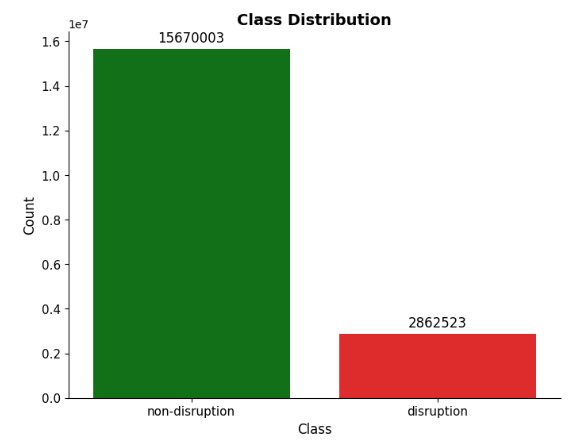

# CS 165 Final Project

## Dataset Overview

The dataset contains **22,556** total shots, each representing a single time series data point that either ends in a **disruption** or not. Each shot is associated with one of three major **tokamaks**:

- **C-MOD**
- **DIII-D**
- **EAST**

Every shot includes:
- A **label**:  
  - `0` for non-disruptive sequences  
  - `1` for disruptive sequences  
- A **machine identifier** (C-MOD, DIII-D, or EAST)  
- A **unique shot index**
- A **dataframe** containing hundreds of rows (depending on the length of the sequence) and **13 feature columns**

The dataset is **open-sourced** and publicly available at:  
🔗 [https://dataverse.harvard.edu/dataset.xhtml?persistentId=doi:10.7910/DVN/XIOHW1](https://dataverse.harvard.edu/dataset.xhtml?persistentId=doi:10.7910/DVN/XIOHW1)

### Feature Columns
| Column                 | Description |
|------------------------|-------------|
| `lower_gap`            | Distance between components in the system |
| `ip_error_normalized`  | Normalized error related to the plasma current |
| `d3d`                  | Binary indicator for DIII-D tokamak |
| `beta_p`               | Ratio of plasma to magnetic pressure (plasma stability metric) |
| `v_loop`               | Loop voltage in the system |
| `kappa`                | Plasma geometry metric |
| `east`                 | Binary indicator for EAST tokamak |
| `n_equal_1_normalized` | Normalized measure for `n=1` instabilities |
| `time`                 | Time series index or timestamp |
| `li`                   | Internal inductance related to magnetic field distribution |
| `cmod`                 | Binary indicator for C-MOD tokamak |
| `greenwald_fraction`   | Density of plasma compared to theoretical maximum |
| `q95`                  | Safety factor at the 95% plasma radius |

## Class Balance

In the full dataset, **non-disruptive shots outnumber disruptive ones** by a ratio of approximately **5.5:1**. This class imbalance is preserved in all dataset splits to reflect real-world distributions.

---

## Data Preprocessing

The preprocessing pipeline includes two stages: **global preprocessing (before train-test split)** and **per-run preprocessing (after data is loaded for a specific experiment)**.

### Global Preprocessing

Before splitting the dataset into training, validation, and test sets, we apply a **clipping operation** on the raw data:

- **All feature values are clipped at the 1st and 99th percentiles**.
- This reduces the influence of extreme outliers and stabilizes the distributions.

### Per-Run Preprocessing

After the dataset is split and saved to disk, each experimental run applies additional preprocessing steps depending on the configuration:

- **Standardizing interval length**:  
  Each shot is truncated or padded to match a fixed temporal length (defined per-machine or globally).
  
- **Undersampling the training set**:  
  To address class imbalance, a configurable portion of non-disruptive shots may be undersampled during training.

- **Data augmentation**:  
  Additional transformations may be applied to augment training data. This includes resampling, masking, or injecting slight noise.

- **Autoregressive cutoff**:  
  A portion of the end of each time series may be **masked or removed** to simulate early warning prediction scenarios, forcing the model to infer disruptions from partial information.

These steps allow us to simulate realistic use cases and robustly test the model’s generalization and early prediction ability.
--

## Dataset Splits

The dataset is split into **training**, **validation**, and **test** sets using pre-defined indices stored in the `data/indices/` directory. Each "case" file defines a different experimental setting:

| Case # | Train Source(s)     | Validation Source(s) | Test Source(s)     |
|--------|----------------------|----------------------|--------------------|
| 1      | DIII-D               | DIII-D               | DIII-D             |
| 2      | C-MOD                | C-MOD                | C-MOD              |
| 3      | EAST                 | EAST                 | EAST               |
| 6      | DIII-D, EAST         | DIII-D, EAST         | C-MOD              |
| 8      | All (C-MOD, DIII-D, EAST) | All             | C-MOD              |
| 12     | C-MOD                | C-MOD                | C-MOD *(less class imbalance)* |

Case 1:
| Dataset     | Total Samples | Disruption % |
|-------------|----------------|---------------|
| Train       | 5264           | 13.66%        |
| Test        | 1129           | 13.73%        |
| Validation  | 1127           | 13.40%        |

| Dataset     | Machine | Total Samples | Disruption % |
|-------------|---------|----------------|---------------|
| Train       | D3D     | 5264           | 13.66%        |
| Test        | D3D     | 1129           | 13.73%        |
| Validation  | D3D     | 1127           | 13.40%        |

Case 2:
| Dataset     | Total Samples | Disruption % |
|-------------|----------------|---------------|
| Train       | 2309           | 18.15%        |
| Test        | 494            | 18.22%        |
| Validation  | 495            | 17.98%        |

| Dataset     | Machine | Total Samples | Disruption % |
|-------------|---------|----------------|---------------|
| Train       | CMOD    | 2309           | 18.15%        |
| Test        | CMOD    | 494            | 18.22%        |
| Validation  | CMOD    | 495            | 17.98%        |

Case 3:
| Dataset     | Total Samples | Disruption % |
|-------------|----------------|---------------|
| Train       | 7011           | 20.67%        |
| Test        | 1500           | 20.27%        |
| Validation  | 1498           | 20.69%        |

| Dataset     | Machine | Total Samples | Disruption % |
|-------------|---------|----------------|---------------|
| Train       | EAST    | 7011           | 20.67%        |
| Test        | EAST    | 1500           | 20.27%        |
| Validation  | EAST    | 1498           | 20.69%        |

Case 12 uses a split from prior work ([source](https://arxiv.org/abs/2401.00051)) with a reduced class imbalance, particularly in the test set.

---

## Data Inclusion / Exclusion

All available shots from the three tokamaks (C-MOD, DIII-D, EAST) were included in the dataset. No shots were excluded unless explicitly filtered through the split indices described above. These splits were designed to:

- Preserve **class ratios** across splits  
- Allow for **machine-specific** and **cross-machine generalization** studies  
- Enable **realistic distribution learning** for predictive modeling
